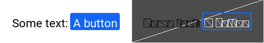

# flexui

*Still in very very early development, for now just prototyping*

A light UI for C++ with XML and CSS support.

### Example

```xml
<Element class="container">
    <Text id="some">Some text:</Text>
    <Button><Text>A button</Text></Button>
</Element>
```
```css
* {
    font-family: "Roboto-Regular.ttf";
    font-size: 24px;
}
.container {
    background-color: white;
    color: black;

    height: 90px;
    padding: 25px;
    align-items: center;
}
#some {
    margin-right: 5px;
}
Button {
    background-color: #1266f1;
    color: white;

    align-items: center;
    padding: 5px;

    border-color: #0d6efd;
    border-width: 1px;
    border-radius: 4px;

    cursor: pointer;
}
Button:hover {
    /* ... */
}
```

Render using OpenGL (and GLFW)  


# Demo

Online demo available here: https://mlomb.github.io/flexui  
Note that the demo is a build of the master branch for now, it may contain anything I'm currently working on (and probably broken)

# Goals

* Support a subset of CSS
* Support XML for building elements
* Fully based on a Flex layout engine (the same engine used by [React Native](https://reactnative.dev), [Yoga Layout](https://yogalayout.com))
* Be render agnostic, the library should only generate vertices and indices
* Be system agnostic, the library should not handle window creation or events

# Non-goals

* Be a browser
* Implement a script layer (no JS or similar)

# Dependencies

* [FreeType](https://www.freetype.org), an open source font rasterizer
* [Yoga Layout](https://yogalayout.com), an open source layout engine
* An embedded copy of [tinyxml2](https://github.com/leethomason/tinyxml2), a fast XML parser

More complex text may require harfbuzz-ng.

# License

MIT, see [LICENSE](LICENSE).